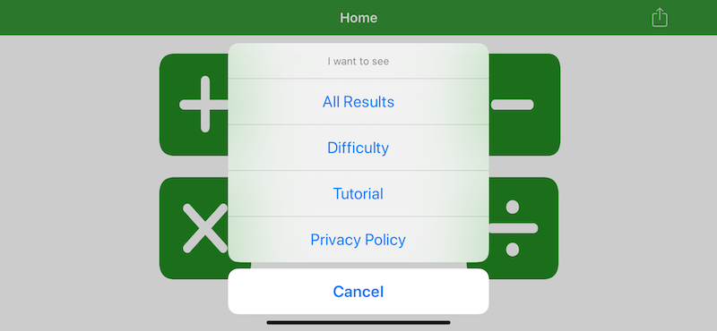
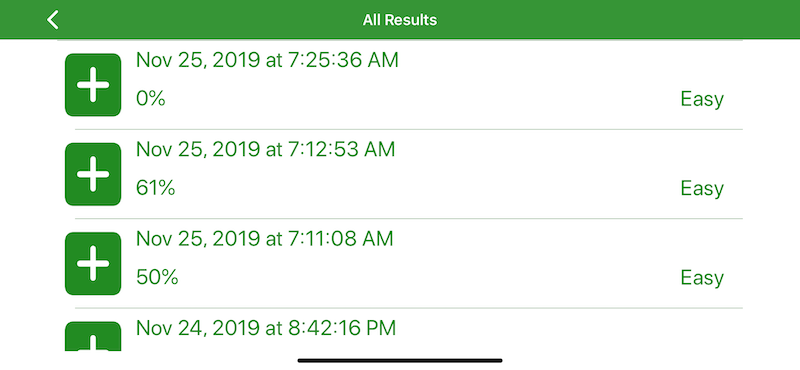
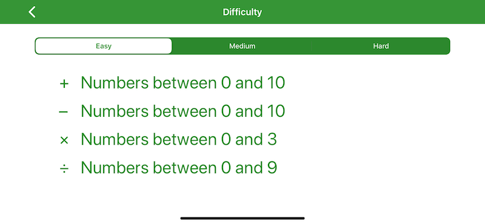
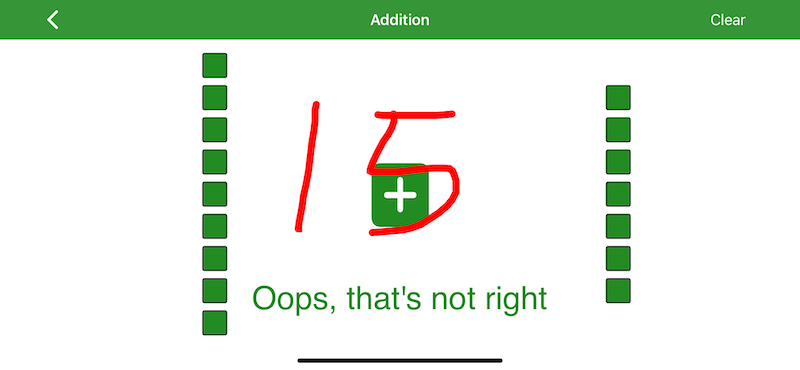

#  Arithmeblocks Support

## General Usage

Overall, the concept behind the app is that you are presented with addition, subtraction, multiplication an division problems. These are answered by writing the correct number anywhere on the screen. If the answer is correct, you move on. Otherwise, the answer is highlighted and you must try again.

## Features

Aside from the core quiz structure of the app, there are several other features accessed from the menu on the home screen.

- All Results

This will show you the results of all quizes that have been taken to date. These can be deleted via the swipe action.

- Difficulty

This allows you to choose from easy, medium and hard difficulty. Each selection shows the possible range of numbers you can see in the problems.

- Tutorial

This provides a brief walk through of using the app and illustrates concepts such as clearing the screen.

- Privacy

This link takes you to the privacy URL for the app.

## Need more help?

Reach out at jmillersmart@gmail.com
